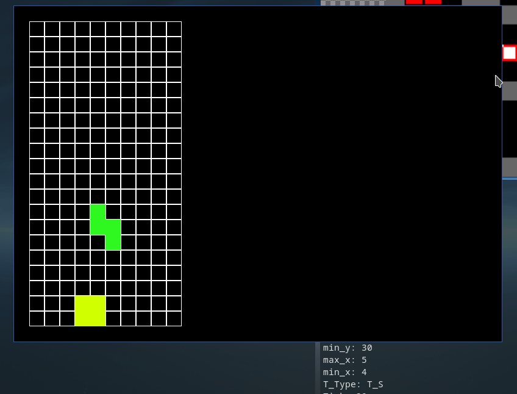

# TetriC
A Tetris clone written in C. 

I intend on making this clone as close to the original port on the NES as possible.

Graphics are rendered using SDL 2.0.

### Pieces Implemented
- [x] I-Piece
- [x] O-Piece
- [x] S-Piece
- [x] Z-Piece
- [ ] L-Piece
- [ ] J-Piece
- [ ] T-Piece

This is a work in progress. There is still a lot to be done so I'm not going to bother 
writing too much about it yet.

