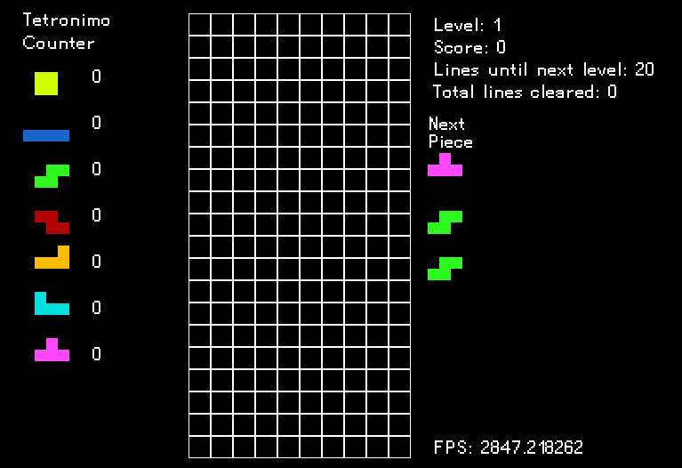

# TetriC

```
Controls:
← ↓ ↑ → : movement
z x : rotate
m : mute/unmute music
```

A Tetris clone written in C. 

I intend on making this clone as close to the original port on the NES, with some changes here and there.

Graphics are rendered using SDL 2.0, so if you want to compile this from source you will need to download
the SDL2 library files for your OS.

This is a work in progress. 

### To Do List
- [ ] Implement a title screen
- [ ] Implement volume controller (instead of just on/off)
- [ ] Implement ghost piece
- [ ] Implement a pause menu (or just the ability to pause)



### Sounds
[sxfr](https://sfxr.me/)
[mixkit](https://mixkit.co/free-sound-effects/game/)
[music](https://archive.org/details/TrepakFromTheNutcracker)
[kenney.nl](https://kenney.nl/assets?q=audio)
