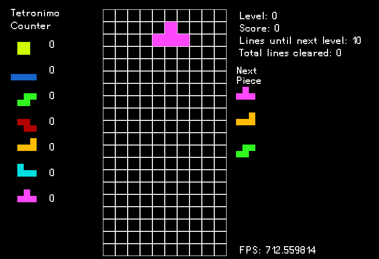

# TetriC

```
Controls:
← ↓ ↑ → : movement
z x : rotate
m : mute/unmute music
```

A Tetris clone written in C. 

I intend on making this clone as close to the original port on the NES, with some changes here and there.

Graphics are rendered using SDL 2.0, so if you want to compile this from source you will need to download
the SDL2 library files for your OS.

This is a work in progress. 

### To Do List
- [X] Make a Makefile
- [X] Make movement less clunky
- [X] Implement player death
- [X] Implement line clearing
- [X] Implement tetronimo statistics
- [X] Implement piece queue
- [X] Implement scoring system
- [X] Implement leveling system
- [ ] Implement a title screen
- [ ] Implement a pause menu (or just the ability to pause)

### Pieces Implemented
- [x] I-Piece
- [x] O-Piece
- [x] S-Piece
- [x] Z-Piece
- [x] L-Piece
- [x] J-Piece
- [x] T-Piece



[trepak.mp3](https://archive.org/details/TrepakFromTheNutcracker)
