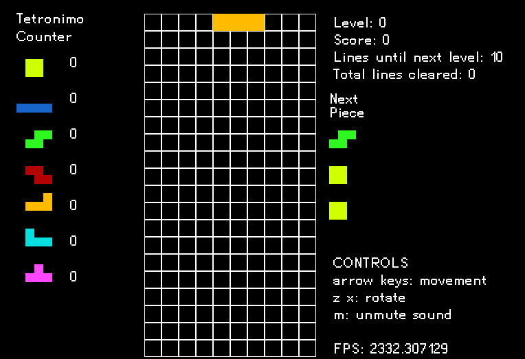

# TetriC

```
Controls:
← ↓ ↑ → : movement
z x : rotate
m : mute/unmute music
```

A Tetris clone written in C. 

I intend on making this clone as close to the original port on the NES, with some changes here and there.

Graphics are rendered using SDL 2.0, so if you want to compile this from source you will need to download
the SDL2 library files for your OS.



# Compiling on Linux

Since I am using SDL2.0, you will need is the SDL2 libraries, as well as the gcc compiler and make.

On Arch Linux: ``sudo pacman -Syu gcc sdl2 make``

On Ubuntu: ``sudo apt-get install gcc make libsdl2-dev libsdl2-2.0``

After installing the necessary packages: 

1. ``git clone`` this repository
2. ``cd`` into the directory you cloned it in
3. compile it with ``make``.

# Compiling on Windows 
**Note:** If you would like to just play the game, you can simply just run the provided ``TetriC.exe``.

1. Clone or download this repository into a folder somewhere on your computer.
2. Install [MSYS2](https://www.msys2.org/). When selecting the installation directory, choose the default.
3. From the link above, follow the instructions that say to run ``pacman -Syu`` and ``pacman -S --needed base-devel mingw-w64-x86_64-toolchain``
in the MSYS2 terminal. This will install the ``gcc`` and ``make`` development tools.
4. After you install ``gcc``, you will need to add it to PATH so that you can run it from the terminal. 
	- Click the search bar by your start menu
	- Type 'Edit system variables' and click on the result
	- Click 'Environment Variables'
	- Under 'System variables' (Not user variables!) select ``Path``, and click the ``Edit...``
	- Click new, then add ``C:\msys64\usr\bin`` to the list and click OK.
	- To verify you performed this steps correctly, open ``cmd`` or ``powershell`` and type gcc.
	- You should receive an error saying ``gcc.exe: fatal error: no input files``
5. After adding ``gcc`` to PATH, you will now need to install the SDL2 libraries.
	- open ``MSYS2 MinGW x64`` (just type it in the Windows search bar)
	- In this terminal, execute the following commands to install the SDL2 libraries
	- ``pacman -S mingw-w64-x86_64-SDL2``
	- ``pacman -S mingw-w64-x86_64-SDL2_ttf``
	- ``pacman -S mingw-w64-x86_64-SDL2_image``
	- ``pacman -S mingw-w64-x86_64-SDL2_mixer``
6. Once you have the steps above complete, you should now be able to compile the source code.
	- Go to the ``Windows`` directory in this repo
	- In the File explorer path name, type ``cmd`` or ``powershell``, this will open a command prompt
	in the directory you are currently in.
	- Type ``./compile.bat``, if everything went well, you should now have a file named ``TetriC.exe`` in
	your Windows folder. You can now open it to play TetriC.
___

### Sounds
- [sxfr](https://sfxr.me/)
- [mixkit](https://mixkit.co/free-sound-effects/game/)
- [music](https://archive.org/details/TrepakFromTheNutcracker)
- [kenney.nl](https://kenney.nl/assets?q=audio)
