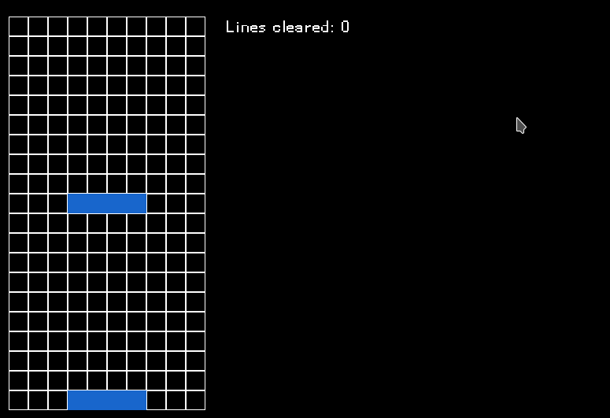

# TetriC
A Tetris clone written in C. 

I intend on making this clone as close to the original port on the NES as possible.

Graphics are rendered using SDL 2.0.

### To Do List
- [ ] Make a Makefile
- [X] Make movement less clunky
- [ ] Implement a UI
- [ ] Implement player death
- [X] Implement line clearing
- [ ] Implement previous piece
- [ ] Implement scoring system
- [ ] Implement leveling system
- [ ] Implement a title screen
- [ ] Implement a pause menu (or just the ability to pause)

### Pieces Implemented
- [x] I-Piece
- [x] O-Piece
- [x] S-Piece
- [x] Z-Piece
- [x] L-Piece
- [x] J-Piece
- [x] T-Piece

This is a work in progress. There is still a lot to be done so I'm not going to bother 
writing too much about it yet.

